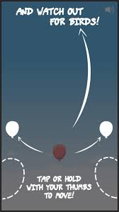

# Overview

Floaty Bloon is a mobile game available on iOS and Android platforms, offering players the opportunity to control a balloon as it ascends into the sky while avoiding birds. With intuitive controls, players can easily move the balloon left or right to dodge the oncoming birds, which become increasingly challenging as the game progresses.

Featuring endless gameplay and a focus on achieving high scores, Floaty Bloon offers an engaging and entertaining experience for players.

# Screenshots

